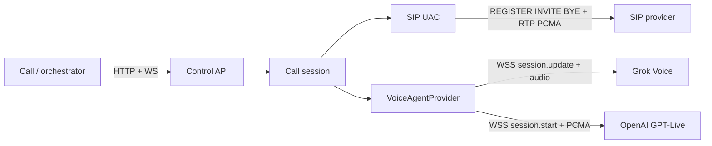

# Bot Call Bridge (`bot-call-bridge`)

Headless phone bridge: **SIP** ↔ **OpenAI GPT-Live-1** or **xAI Grok Voice**. The far-end of the call talks to the voice model. There is no local microphone or speaker.

Switch voice with `VOICE_PROVIDER=openai|grok|mock` — paste only the matching API key; models/voices/URLs ship with working defaults.

An orchestrator (or a Grok Bot **Call** agent) posts a SCRIPT — who to call, language, goals, constraints, fallbacks, AI disclosure. This process registers to **your** SIP provider, dials, and pipes G.711 a-Law RTP to/from the voice WebSocket as a virtual mic/speaker.

SIP is provider-agnostic (`SIP_REGISTRAR` / `SIP_PROXY` / `SIP_DOMAIN`). Voice is provider-agnostic behind `VoiceAgentProvider` (Grok Realtime and OpenAI GPT-Live for PCMA duplex).

**Reference live path** for a cloud / Grok-bot box: **[OVH SIP](docs/providers/ovh.md)** (softphone line, `sip3.ovh.fr`-class registrar). VoipWise is documented but often rejects datacenter IPs — see [providers](docs/providers/README.md).



## Repo map

| Path | Role |
|---|---|
| `src/call_bridge/` | Bridge runtime (SIP, RTP, voice, HTTP/WS) |
| `docs/providers/` | How to add / operate a SIP carrier |
| `skills/` | Call-bot skills (setup, troubleshoot, handle-a-call, package) |
| `bot/` | Call persona + memory stubs for a later Grok Bot share |
| `scripts/package-call-bot.sh` | Assemble a shareable staging folder |

## Quickstart (mock)

No SIP creds or xAI key required.

```bash
python3 -m venv .venv
source .venv/bin/activate
pip install -e ".[dev]"
cp .env.example .env
BRIDGE_MODE=mock python -m call_bridge
```

Open [http://127.0.0.1:43123](http://127.0.0.1:43123). Place `examples/script.sample.json`. The mock voice discloses, asks the orchestrator a question, and waits for a tool result.

```bash
pytest
```

## Live requirements

1. A SIP **softphone** line that accepts REGISTER from **this machine’s egress IP**. Cloud box → start with [OVH](docs/providers/ovh.md).
2. Voice key: `XAI_API_KEY` + `VOICE_PROVIDER=grok`, or `OPENAI_API_KEY` + `VOICE_PROVIDER=openai`.
3. UDP open for `SIP_LOCAL_PORT` (default **5062**, unprivileged) and `SIP_RTP_PORT_START`–`END`.
4. Reachable RTP: `SIP_ADVERTISE_HOST` or STUN (`STUN_SERVER`).

```bash
cp .env.example .env
# fill SIP_* from docs/providers/<your-provider>.md
# fill XAI_API_KEY
set -a && source .env && set +a
BRIDGE_MODE=live VOICE_PROVIDER=grok python -m call_bridge
```

Live boot **fails fast** if registrar/domain/creds or `XAI_API_KEY` are missing, or if REGISTER is rejected. `+33…` is rewritten to `00…` for the SIP URI.

See `skills/setup/SKILL.md` for the operator checklist and `skills/troubleshoot/SKILL.md` when REGISTER/audio fails.

## Control API

| Action | Endpoint |
|---|---|
| Dial | `POST /v1/calls` `{ "script": {…} }` |
| Hang up | `POST /v1/calls/{id}/hangup` |
| Mid-call steer | `POST /v1/calls/{id}/guidelines` `mode=steer\|speak` |
| Answer a tool | `POST /v1/calls/{id}/tool-results` |
| Live events | `WS /v1/calls/{id}/events` |
| Health | `GET /health` · `GET /v1/status` |

Agent context (goals, ownership, what not to add) and Call-agent contract: [`AGENTS.md`](AGENTS.md). Sample SCRIPT: `examples/script.sample.json` (anonymized).

## Voice providers

- **Grok** — `wss://api.x.ai/v1/realtime`, native `audio/pcma`, `server_vad`, function tools, `force_message`.
- **OpenAI GPT-Live-1** — `wss://api.openai.com/v1/live/sessions`, native `audio/pcma` @ 8 kHz (rate required), client delegation for hangup / ask_orchestrator. Set `VOICE_PROVIDER=openai` plus `OPENAI_API_KEY`, optional `OPENAI_LIVE_MODEL` / `OPENAI_VOICE` (e.g. `marin`, `cedar`). `speak_verbatim` uses `session.instructions.append` (no Grok `force_message`).

## Add a VoIP provider

Write `docs/providers/<name>.md` using the [checklist](docs/providers/README.md). Fill `SIP_*`. No code change unless the carrier needs a dial or transport exception.

## Limits

- One concurrent call (`MAX_CONCURRENT_CALLS=1`)
- Outbound only, UDP SIP, PCMA only
- Idle hangup after `CALL_IDLE_TIMEOUT_SECONDS` (default 30; `0` disables) with no user/assistant voice activity
- Control plane unauthenticated — bind privately
- No Twilio/Telnyx required
